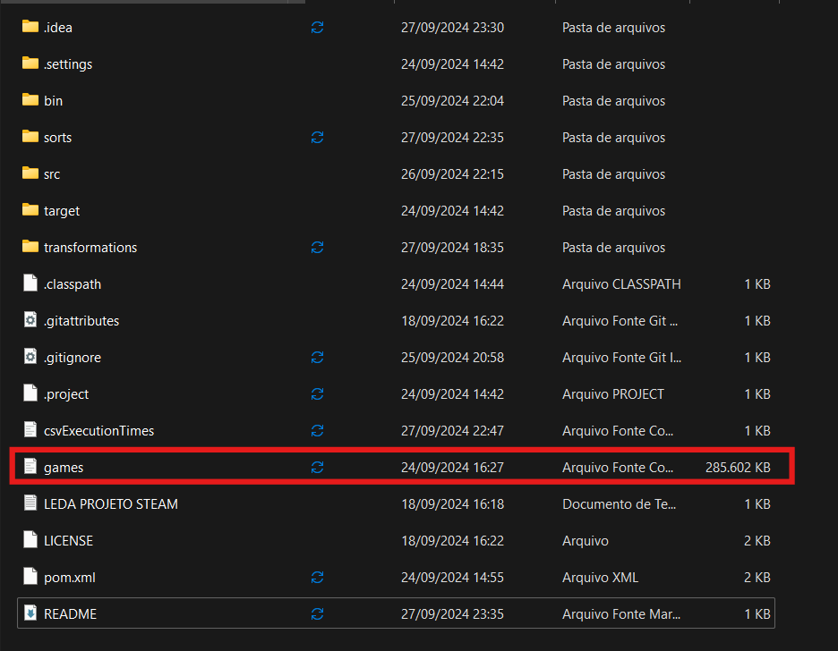

# LEDA_PROJETO_UT1

# Requisitos
- Apache Maven 3.9.7 ou superior
- JDK 8 ou superior
- Preferencialmente, abrir o projeto com o Intellij IDE

# Antes de inciar o programa
- baixe o arquivo "games.csv" disponível em: https://www.kaggle.com/datasets/fronkongames/steam-games-dataset
- Coloque o dataSet dentro do diretório raiz do projeto

- Contrua o projeto com o Maven 
